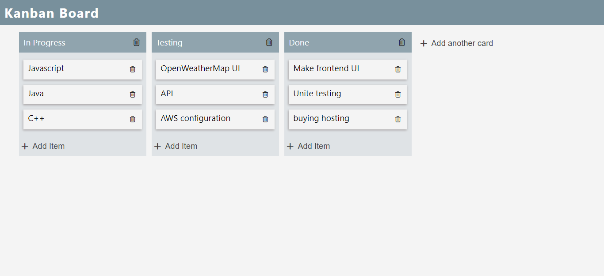
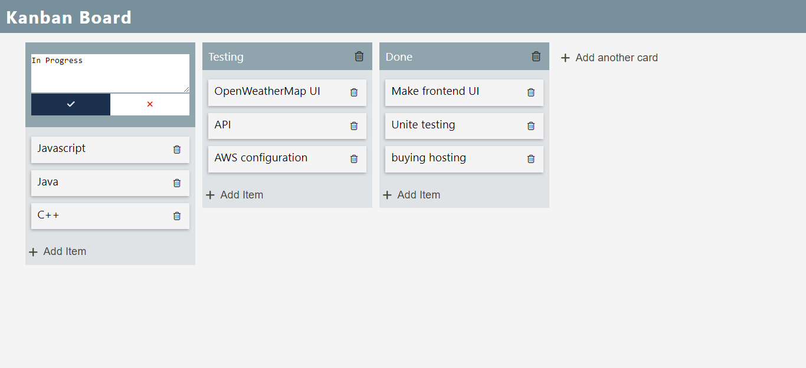
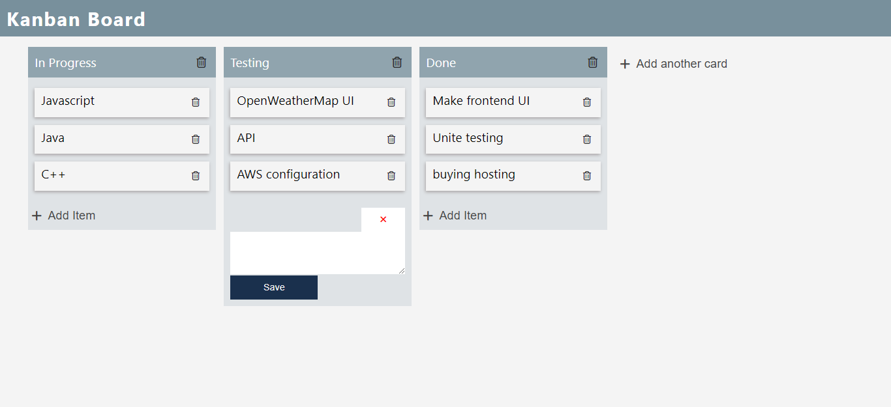
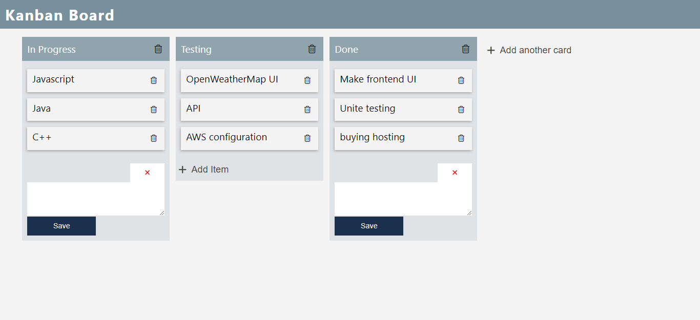
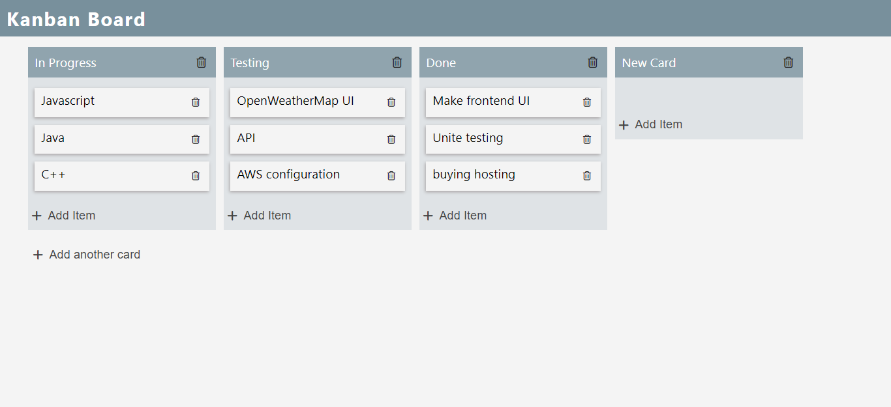

# This is a kanban board app using React.js

## Screenshots of this app

For running this app you should type command given bellow
### `npm start`

Runs the app in the development mode.\
Open [http://localhost:3000](http://localhost:3000) to view it in the browser.
